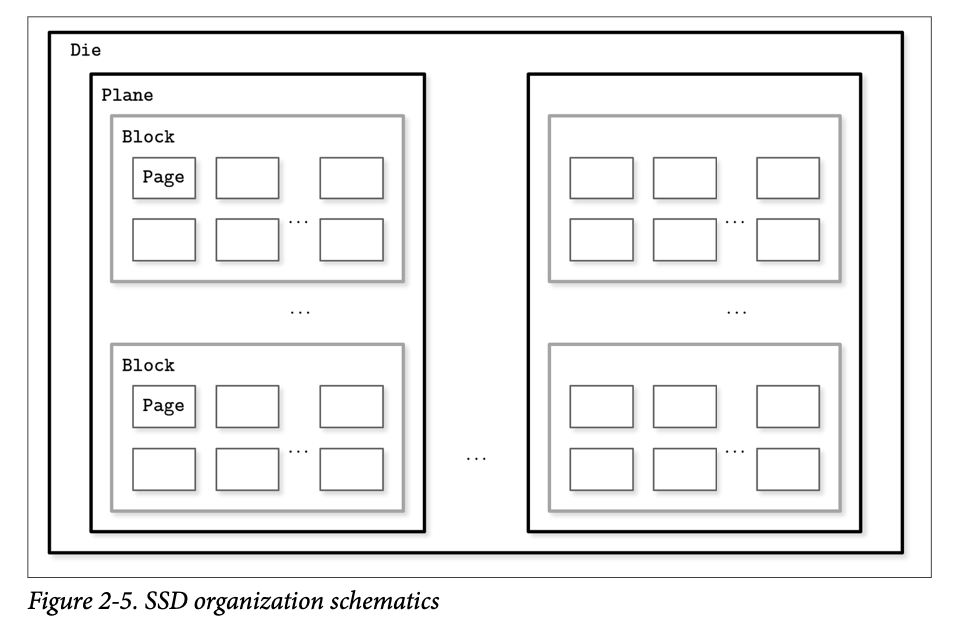

# B-Tree Basics

## Trees for Disk-Based Storage
- High fanout to improve locality of the neighboring keys.
- Low height to reduce the number of seeks during traversal.
- Fewer disk accesses, reducing the number of out-of-page pointers.
- Low frequency of balancing operations

## Disk-Based Structures

### Solid State Drives(SSDs)
A typical SSD is built of memory cells, connec‐ ted into strings (typically 32 to 64 cells per string), strings are combined into arrays, arrays are combined into pages, and pages are combined into blocks.

Depending on the exact technology used, a cell can hold one or multiple bits of data. Pages vary in size between devices, but typically their sizes range from 2 to 16 Kb. Blocks typically contain 64 to 512 pages. Blocks are organized into planes and, finally, planes are placed on a die. SSDs can have one or more dies

The smallest unit that can be written (programmed) or read is a page. However, we can only make changes to the empty memory cells (i.e., to ones that have been erased before the write). The smallest erase entity is not a page, but a block that holds multi‐ple pages, which is why it is often called an erase block. Pages in an empty block have to be written sequentially.