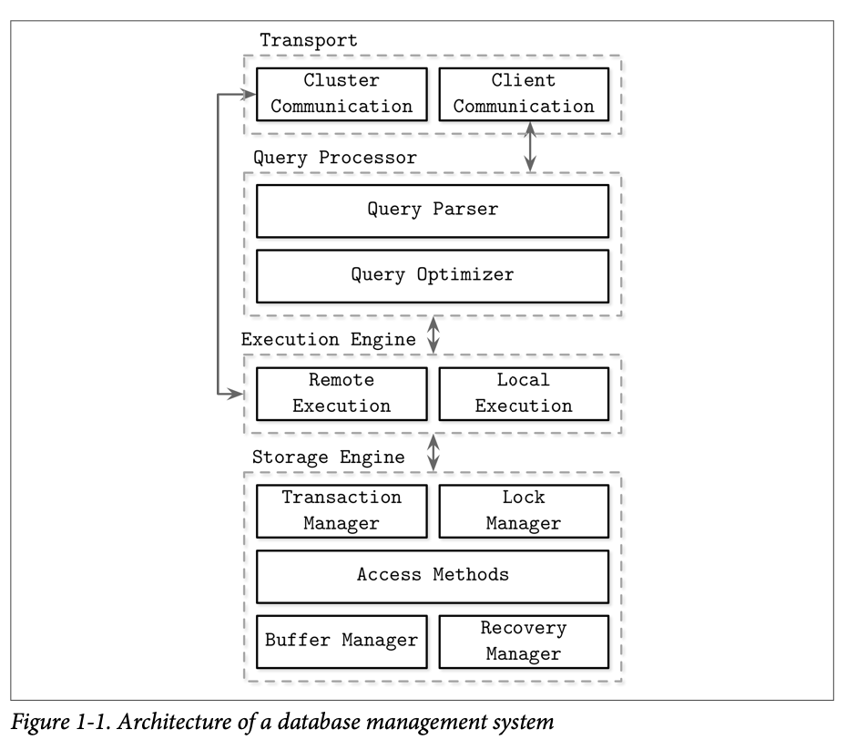

# Database Internals

## Database Management Systems Classifications

Classified by storage medium:
- In-memory DBMS
- Disk-Based DBMS

Cassified by layout:
- Column-oriented Data Layout DBMS
- Row-oriented Data Layout DBMS

Other:
- Online transaction processing (OLTP) databases
- Online analytical processing (OLAP) databases
- Hybrid transactional and analytical processing (HTAP)

## DBMS Architecture

## DBMS Component

### Query Plan

### Execution Engine

### Storage Engine

#### Data Layout
- Column-oriented Data Layout
- Row-oriented Data Layout

#### Data Files
- index-organized tables
- heap-organized tables
- hash-organized tables

#### Index Files
- Primary Index as an Indirection

#### Storage Engine Data Structure
